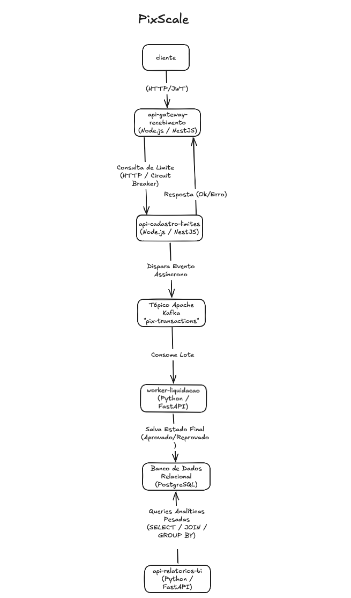

# PixScale - Sistema de Liquidação de Pagamentos Instantâneos em Alta Escala

O PixScale é um ecossistema de processamento de pagamentos instantâneos em alta escala, desenvolvido para simular uma infraestrutura financeira real. O projeto demonstra uma arquitetura de microsserviços assimétrica projetada para lidar com milhares de requisições por segundo (RPS), implementando padrões essenciais de resiliência, concorrência e arquitetura orientada a eventos.

## 🏗️ Desenho Arquitetural

O sistema é dividido em quatro serviços especializados para respeitar o Princípio de Responsabilidade Única (SRP) e otimizar a alocação de recursos de infraestrutura:

1. **`api-gateway-recebimento` (Node.js / NestJS)**: O serviço de borda. Responsável pela autenticação dos clientes (JWT), sanitização de inputs e controle de taxa (*Rate Limiting*). Ele orquestra as validações estruturais consultando o serviço de limites e encaminha as transações de forma assíncrona usando o padrão **Fire & Forget**.
2. **`api-cadastro-limites` (Node.js / NestJS)**: Gerencia os dados cadastrais das contas dos usuários, saldos e regras de transações diárias. Fica protegido atrás de um **Circuit Breaker** para evitar que falhas nessa dependência derrubem o gateway principal.
3. **`worker-liquidacao` (Python / FastAPI)**: O motor transacional de alto desempenho. Consome os fluxos de eventos do Apache Kafka nativamente através de **Corrotinas** cooperativas. Ele garante a **Idempotência** do sistema utilizando o Redis para descartar payloads duplicados instantaneamente.
4. **`api-relatorios-bi` (Python / FastAPI)**: O motor analítico completamente isolado do fluxo de escrita transacional.



## 🛠️ Tecnologias & Infraestrutura

- **Linguagens e Frameworks**: Node.js (NestJS) & Python (FastAPI)
- **Banco de Dados**: PostgreSQL
- **Cache e Chave-Valor**: Redis
- **Mensageria/Streaming**: Apache Kafka
- **Implantação**: Docker & Docker Compose


## 📂 Estrutura do Projeto

```text
PixScale/
├── pix-scale/
│   ├── infra/
│   │   └── database/
│   │       └── schema.sql
│   └── docker-compose.yml
└── README.md
```
